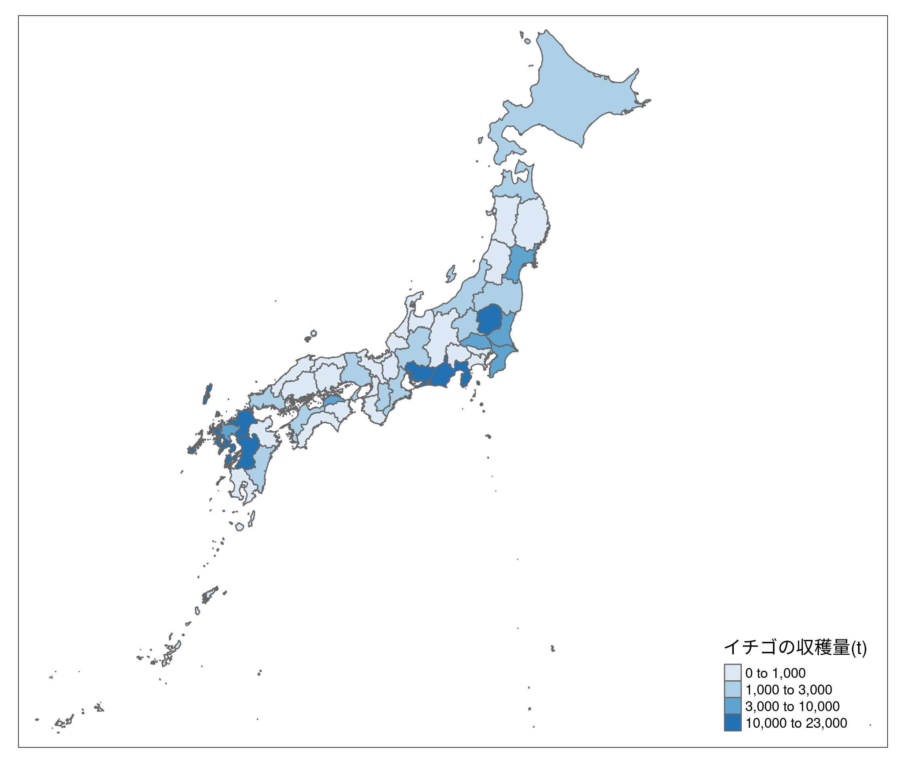
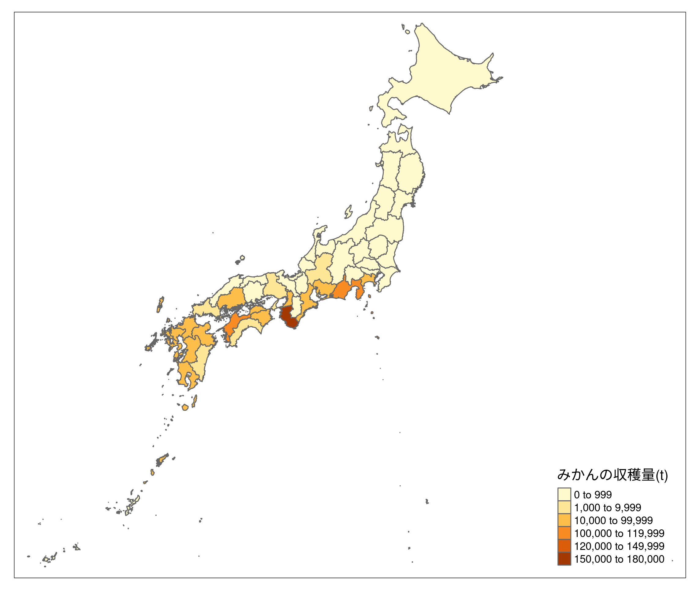
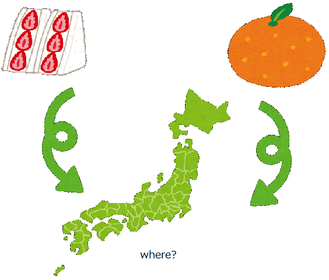

```{r setup, include=FALSE}
knitr::opts_chunk$set(echo = TRUE)
```

```{r ready, include=FALSE}
library(sf)
library(raster)
library(dplyr)
library(stringr)
library(tidyr)

library(spData)

library(tmap)    # for static and interactive maps
library(leaflet) # for interactive maps
library(ggplot2) # tidyverse data visualization package
```

```{r test1, include=FALSE}
#データの読み込みと統合。
STR1 = read.csv("f005-02-084-processing.csv")
ORA1 = read.csv("f006-02-007-processing2.csv")
#以下は生産していない都道府県を抜いたデータ。
STR0 = read.csv("f005-02-084-processing_except_zero.csv")
ORA0 = read.csv("f006-02-007-processing2_except_zero.csv")

adm = st_read("JPN/JPN_adm1.shp")
JPN_STR2 = left_join(adm, STR1)
JPN_ORA2 = left_join(adm, ORA1)
JPN_STR0 = left_join(adm, STR0)
JPN_ORA0 = left_join(adm, ORA0)
```

```{r test2, include=FALSE}
#収穫量、出荷量、10a当たり収量の数字が文字列だったので数字に直す。
JPN_STR3 = JPN_STR2 %>% mutate(H = gsub(",","",JPN_STR2$収穫量.t.) %>% as.numeric())
JPN_STR3 = JPN_STR3 %>% mutate(Ship = gsub(",","",JPN_STR2$出荷量.t.) %>% as.numeric())
JPN_STR3 = JPN_STR3 %>% mutate(X10a = gsub(",","",JPN_STR2$X10a当たり収量.kg.) %>% as.numeric())

JPN_STR30 = JPN_STR0 %>% mutate(H = gsub(",","",JPN_STR0$収穫量.t.) %>% as.numeric())
JPN_STR30 = JPN_STR30 %>% mutate(Ship = gsub(",","",JPN_STR0$出荷量.t.) %>% as.numeric())
JPN_STR30 = JPN_STR30 %>% mutate(X10a = gsub(",","",JPN_STR0$X10a当たり収量.kg.) %>% as.numeric())

#直してtmapで表現。
breaks1 = c(0,1,3,10,23)*1000
map_STR = tm_shape(JPN_STR3) + tm_polygons(col ="H",palette="Blues",breaks =breaks1, title="イチゴの収穫量(t)")
tmap_save(tm = map_STR,filename = "map_STR.png")

breaks2 = c(0,1,10,100,120,150,180)*1000
map_ORA = tm_shape(JPN_ORA2) + tm_polygons(col ="H",breaks = breaks2, title="みかんの収穫量(t)")
map_ORA
tmap_save(tm= map_ORA,filename = "map_ORA.png")
```

```{r data_analysis, include=FALSE}
#収穫量の平均、分散、標準偏差
AVS_STR_H <- c(mean(JPN_STR3$H), var(JPN_STR3$H), sd(JPN_STR3$H))
AVS_STR_H #[1]     3003.617 24040780.111     4903.140
AVS_ORA_H <- c(mean(JPN_ORA2$H), var(JPN_ORA2$H), sd(JPN_ORA2$H))
AVS_ORA_H #[1] 1.629438e+04 1.231171e+09 3.508804e+04

#総収穫量
SUM_STR = sum(JPN_STR3$H) #141170t
SUM_ORA = sum(JPN_ORA2$H) #765836t

STR_NUM = 24 #いちごを生産する都道府県数
ORA_NUM = 38 #みかんを生産する都道府県数

Ave_STR = SUM_STR / STR_NUM #20153.5....
Ave_ORA = SUM_ORA / ORA_NUM #5882.083...

```
## 0. 要旨
野菜や果物は、食生活での栄養、嗜好上で欠かせないものとなっている。しかしながら、その品目によって生産される地域は大きく異なる。そこで今回はイチゴ（野菜）とみかん（果物）の収穫量や生産地域の違いを可視化して、見比べ分析した。すると、生産地域の特徴や収穫量の特徴などが見えてきた。
  

## 1. はじめに
### 1.1 背景
日本では様々な農作物の生産が盛んであり、それらの加工品などを食卓などにおいて目にするのは頻繁なことである。しかし、都道府県によって栽培される農作物は大きく異なる。それは様々な気候条件や周辺環境に大いに依存してくる。そこで今回は、代表的にイチゴやみかんをデータとしてみた時にマップ上でどのような分布を見せてくれるのかを観察する。

### 1.2 目的
本レポートでは、イチゴやみかんの生産量の可視化及び、関連データの分析を目的とする。

## 2. 手法
マップによる可視化や各種計算のために、プログラミング言語Rおよびtmapパッケージを用いる。

## 3. データ
今回の分析に用いるデータとして、e-Stat(政府統計の総合窓口)の作物統計調査[1]の野菜調査、および作況調査（果樹）の項目からそれぞれイチゴ、みかんの作付面積（結果樹面積）、10a当たりの収量、収穫量、そして出荷量を持つデータを使用する。なお今回はともに令和2年度（確報）のデータを用いる。

## 4. 結果
イチゴの生産量分布は以下の通りとなった。
```{r gra1, echo=FALSE}

```

そしてみかんの生産量分布は以下の通りとなった。
```{r gra2, echo=FALSE}

```

イチゴの総生産量は141170t、みかんの生産量は765836tであった。また平均（４７都道府県全体）はそれぞれ、約3000t、約16000tであった。生産されている都道府県全体に絞った場合の平均はそれぞれ、約5900t、約20000tであった。

## 5. 考察
収穫量を表したマップから、イチゴは全国的に広い地域で栽培され、みかんは比較的、南寄りの都府県で栽培される傾向が確認できた。これにより、地域間の気候条件によって栽培できる種類が異なってくることが、一部なりとも確認することができる。

## 6. 結論
今回はイチゴやみかんの収穫量をマップ上で可視化し、どこで生産が盛んなのかを確認してきた。今後の展望としてこの方法は、ほかの品目についても調査する際にも有効なので、機会があれば調べてみたいと思う。

## 7. Graphic Abstract
レポートを表す１枚の図をここで示す。

```{r abst,echo=FALSE}

```


## 8. 参考文献
[1]: https://www.e-stat.go.jp/stat-search/files?page=1&toukei=00500215&tstat=000001013427　